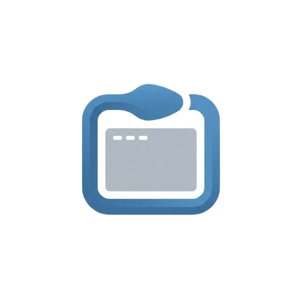

<p align="center">
  
</p>

<h1 align="center">PyScope</h1>

<p align="center">
  <strong>A Modern Python Package Manager with GUI</strong>
</p>

<p align="center">
  Lightweight, fast, and intuitive GUI application for managing Python packages across multiple environments.
</p>

<p align="center">
  <a href="#features">Features</a> •
  <a href="#installation">Installation</a> •
  <a href="#usage">Usage</a> •
  <a href="#supported-environments">Environments</a> •
  <a href="#contributing">Contributing</a>
</p>

---

## ✨ Features

### 🔄 Multi-Environment Support
- **System Python** — Manage packages in your global Python installation
- **Virtual Environments (venv)** — Full support for standard Python virtual environments
- **Conda Environments** — Seamless integration with Anaconda/Miniconda
- **Pyenv** — Automatic detection of pyenv-managed Python versions

### 📦 Package Management
- **Install packages** directly from PyPI with version selection
- **Uninstall packages** safely with dependency awareness
- **Update packages** individually or check all at once
- **Real-time search** with instant filtering

### 🔍 Update Detection
- Check installed packages against PyPI for available updates
- Visual status indicators: ✅ Updated, ⚠️ Outdated, ❓ Unknown
- Parallel checking with rate limiting for optimal performance

### 🎨 Modern Interface
- Clean, intuitive dark theme UI built with PySide6/Qt6
- Responsive design with background threading
- Progress indicators for all operations
- Detailed package information dialogs

---

## 📥 Installation

### Option 1: Standalone Executable (Windows)

1. Download `PyScope.exe` from the [Releases](https://github.com/Limitless-Soul1/PyScope/releases) page
2. Double-click to run — **No Python installation required!**

### Option 2: From Source

```bash
# Clone the repository
git clone https://github.com/Limitless-Soul1/PyScope.git
cd PyScope

# Install dependencies
pip install -r requirements.txt

# Run the application
python app.py
```

### Dependencies

```
PySide6>=6.5.0
```

---

## 🚀 Usage

### Main Interface

| Component | Description |
|-----------|-------------|
| **Environment Selector** | Switch between detected Python environments |
| **Package List** | View all installed packages with version info |
| **Search Bar** | Filter packages instantly by name |
| **Status Filters** | Toggle between All / Updated / Outdated |

### Quick Actions

- **Check for Updates** — Scan all packages against PyPI
- **Install Package** — Search and install from PyPI
- **Double-click Package** — View details, update, or uninstall

### Keyboard Shortcuts

| Shortcut | Action |
|----------|--------|
| `Ctrl+F` | Focus search bar |
| `F5` | Refresh package list |
| `Enter` | Open package details |

---

## 🌍 Supported Environments

| Environment Type | Auto-Detection | Status |
|------------------|----------------|--------|
| System Python | ✅ | Full Support |
| venv | ✅ | Full Support |
| Conda/Miniconda | ✅ | Full Support |
| Pyenv | ✅ | Full Support |
| Poetry | ⚠️ | Planned |

### Environment Detection Locations

**Windows:**
- `C:\Python*`
- `%LOCALAPPDATA%\Programs\Python\*`
- `%USERPROFILE%\Anaconda3\envs\*`
- `%USERPROFILE%\Miniconda3\envs\*`

**Linux/macOS:**
- `/usr/bin/python*`
- `/usr/local/bin/python*`
- `~/.pyenv/versions/*`
- `~/anaconda3/envs/*`
- `~/miniconda3/envs/*`

---

## 📁 Project Structure

```
PyScope/
├── app.py                  # Application entry point
├── requirements.txt        # Project dependencies
├── PyScope.spec            # PyInstaller configuration
├── icons/                  # UI icons and assets
│   ├── logo.png
│   ├── logo.ico
│   └── ...
├── dist/
│   └── PyScope.exe         # Compiled executable
├── pyscope/                # Core package
│   ├── __init__.py
│   ├── core.py             # Package management engine
│   ├── environments.py     # Environment detection
│   ├── system.py           # System utilities
│   ├── utils.py            # Helper functions
│   └── ui/                 # User interface
│       ├── __init__.py
│       ├── main_window.py  # Main application window
│       └── dialogs.py      # Dialog components
└── tests/                  # Test suite (coming soon)
```

---

## 💻 System Requirements

| Requirement | Minimum |
|-------------|---------|
| **OS** | Windows 10/11, Linux, macOS |
| **Python** | 3.8+ (for source installation) |
| **RAM** | 100 MB |
| **Disk Space** | 50 MB |

### Platform Support

| Platform | Status |
|----------|--------|
| Windows 10/11 | ✅ Fully Supported |
| Linux (Ubuntu/Debian) | ⚠️ Experimental |
| macOS | ⚠️ Experimental |

---

## 🔧 Building from Source

### Create Standalone Executable

```bash
# Install PyInstaller
pip install pyinstaller

# Build executable
pyinstaller PyScope.spec
```

The executable will be created in the `dist/` folder.

---

## 🤝 Contributing

Contributions are welcome! Here's how you can help:

1. **Fork** the repository
2. **Create** a feature branch (`git checkout -b feature/amazing-feature`)
3. **Commit** your changes (`git commit -m 'Add amazing feature'`)
4. **Push** to the branch (`git push origin feature/amazing-feature`)
5. **Open** a Pull Request

### Development Setup

```bash
git clone https://github.com/Limitless-Soul1/PyScope.git
cd PyScope
pip install -r requirements.txt
python app.py
```

---

## 📄 License

This project is licensed under the **MIT License** — see the [LICENSE](LICENSE) file for details.

---

## ⚠️ Disclaimer

PyScope interacts directly with Python environments and package managers. Always verify the selected environment before installing or removing packages to avoid unintended changes to your system.

---

<p align="center">
  Made with ❤️ by <a href="https://github.com/Limitless-Soul1">Limitless-Soul1</a>
</p>
